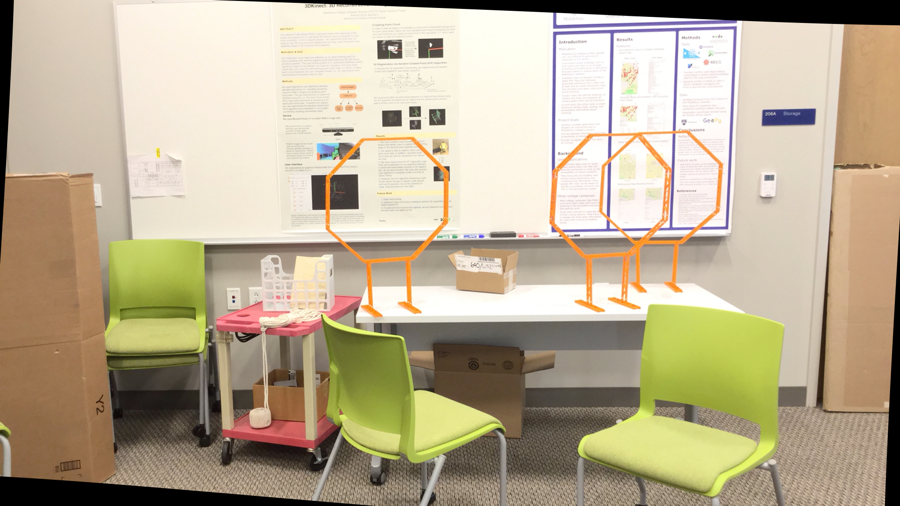
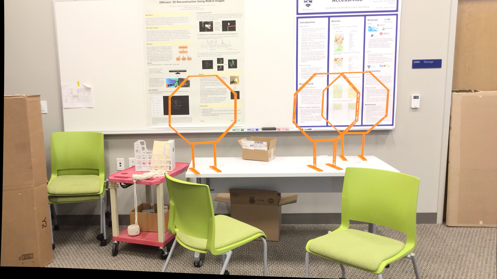

# Stereo Vision


Stereo Vision is a project designed to generate disparity and depth maps given two images of the same object captured from different camera angles. The project leverages computer vision techniques like feature matching, fundamental matrix computation, and epipolar geometry to provide accurate visual representations of depth.

---

## 📝 Description

Given a set of two images of the same object from different camera angles, this project attempts to:
- Compute the disparity map.
- Generate the depth map.

### Example Input Data
- **Stereo Images**: Images of the same object captured from two different perspectives.




- **Camera Parameters**: Used for accurate 3D reconstruction.

---

## 🚀 Approach

The project pipeline includes the following steps:

1. **Feature Matching**:
   - Detect features using ORB (Oriented FAST and Rotated BRIEF).
   - Match features between the two images.

2. **Fundamental and Essential Matrices**:
   - Compute the Fundamental Matrix using point correspondences (Least Squares and RANSAC).
   - Derive the Essential Matrix from the Fundamental Matrix.

3. **Rotation and Translation**:
   - Decompose the Essential Matrix to obtain Rotation and Translation matrices.

4. **Image Rectification**:
   - Warp the images using Perspective Transforms for rectification.
   - Compute Epipolar Lines based on the rectified images.

5. **Disparity Map**:
   - Use a sliding window approach to find pixel correspondences.
   - Compute disparity as the pixel location difference.
   - Generate grayscale and heatmap visualizations.

6. **Depth Map**:
   - Compute depth using triangulation formulas.
   - Generate grayscale and heatmap visualizations.

---

## 📊 Output
### Feature Matching


### Epipolar Lines on Rectified Images


### Disparity Map 


<p align="center">
    
</p>

---

## 📂 Data

The input data consists of:
1. Stereo Images: Pairs of images like `im0.png` and `im1.png` taken from slightly different perspectives.
2. Camera Calibration Parameters: Found in `calib.txt` for each dataset.

---

## 🛠️ Getting Started

Install all dependencies via pip:
```bash
pip install -r requirements.txt
